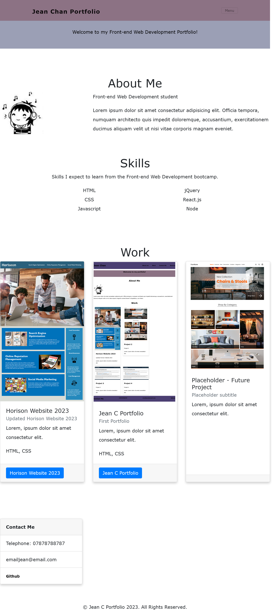

# <Jean C  Bootstrap Portfolio>

## Jean C Portfolio Website

The motivation for this project was to create an interactive website to showcase my front-end web development skills.

The website provides links to my work, resume and GitHub account. It was made using Bootstrap 4 components.

## Installation

N/A

## Usage
The Jean C Portfolio contain four sections: About Me, Work, Contact Me, and Resume.

To navigate each section, select one of the four corresponding links at the top of the page.

1. URL of the deployed application:
https://jeanj22.github.io/JeanC-Bootstrap-Portfolio/

2. URL of the GitHub repository:
https://github.com/Jeanj22/JeanC-Bootstrap-Portfolio

## Screenshot 
 

    

## Credits
N/A

## License
N/A
